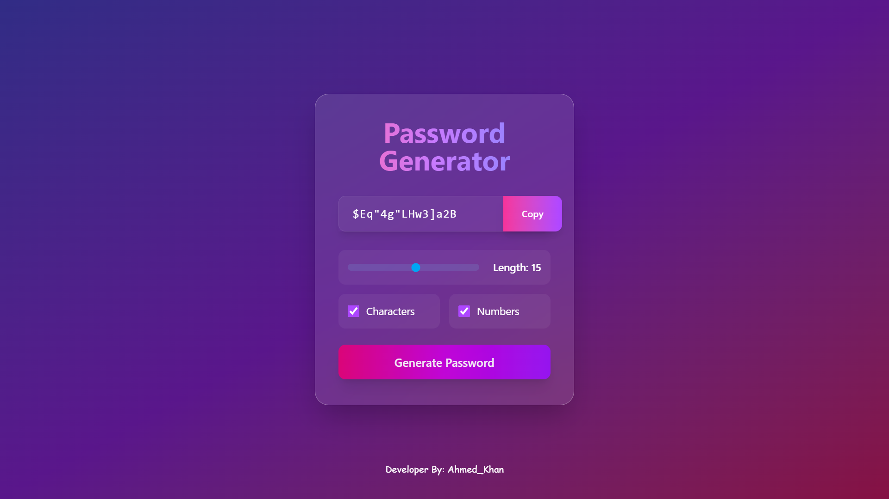

# Password Generator

This is a simple password generator application that allows users to create custom passwords. This application uses React and Tailwind CSS.

## Features

- Select password length (1 to 30)
- Allow the use of letters and numbers
- Copy the generated password

## Technologies

- [React](https://reactjs.org/)
- [Vite](https://vitejs.dev/)
- [Tailwind CSS](https://tailwindcss.com/)

## Usage

1. Clone the project:
   ```bash
   git clone https://github.com/ahmedkhan-dev99/passwordgenerator.git
   ```

2. Navigate to the directory:
   ```bash
   cd passwordgenerator
   ```

3. Install dependencies:
   ```bash
   npm install
   ```

4. Run the application:
   ```bash
   npm run dev
   ```

5. Open your browser and go to `http://localhost:3000`.

## Screenshot



## Contributing

If you would like to contribute to this project, please open an issue or submit a Pull Request.

## License

This project is licensed under the MIT License.
